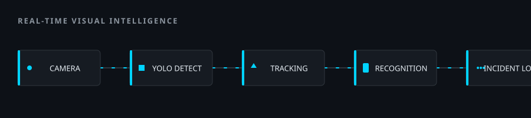
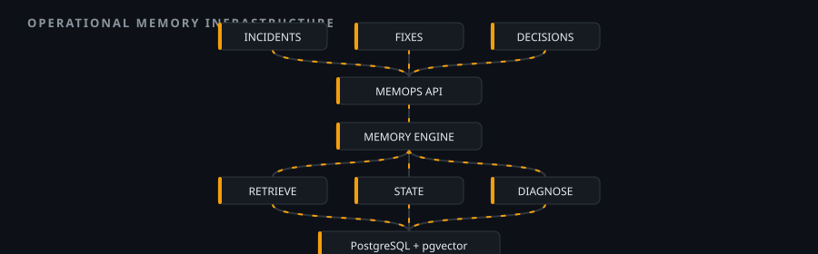
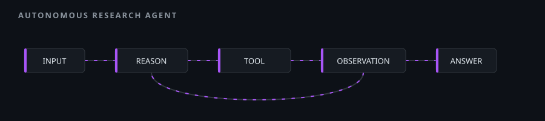

<div align="center">



<br/>

<a href="https://github.com/HarshithGhanashyam"></a>
&nbsp;
<a href="mailto:harshithghanashyam@gmail.com"></a>
&nbsp;
<a href="https://github.com/HarshithGhanashyam"></a>
&nbsp;
<a href="https://www.linkedin.com/in/harshith-ghanashyam-222599349/"></a>

<br/><br/>


</div>


<br/>

<div align="center">

### I build intelligent systems at the intersection of perception, AI, and software engineering.

From real-time computer vision pipelines to autonomous reasoning agents to operational memory infrastructure — I design systems where raw perception becomes structured intelligence, and intelligence becomes reliable, deployable software.

</div>

<br/>


<br/>

<div align="center">

</div>

## `CORE IDENTITY`

<table width="100%">
<tr>
<td width="33%" align="center" valign="top">


### 👁️ VISION

**Perception · Detection · Recognition**

Real-time video processing, object detection with YOLOv8, face recognition via InsightFace, multi-object tracking, and visual analytics pipelines that turn raw camera feeds into structured, searchable intelligence.

</td>
<td width="33%" align="center" valign="top">



### 🧠 INTELLIGENCE

**Reasoning · Retrieval · Generation**

RAG pipelines with hybrid retrieval, autonomous ReAct-style agents with tool orchestration, reinforcement learning systems, and LLM-powered applications — all designed for auditability and zero-dependency operation.

</td>
<td width="33%" align="center" valign="top">


### ⚙️ SYSTEMS

**Architecture · APIs · Infrastructure**

FastAPI backends, PostgreSQL with pgvector, multi-tenant REST APIs, Docker deployments, and full-stack applications with Next.js — built with clean boundaries, proper testing, and production-grade observability.

</td>
</tr>
</table>

<div align="center">

> **The direction is deliberate: move from isolated models toward complete, auditable systems.**

</div>

<br/>


<br/>

## `HOW I THINK`

<div align="center">



</div>

<br/>

<table width="100%">
<tr>
<td width="33%" valign="top">

**OBSERVE** — Study the problem space. Understand the domain, the data, the constraints, and the failure modes before writing any code.

</td>
<td width="33%" valign="top">

**REASON** — Design the architecture. Define boundaries, data flows, and contracts. Choose the simplest approach that handles the real complexity.

</td>
<td width="33%" valign="top">

**BUILD & VERIFY** — Implement incrementally. Test at every layer. Ship something inspectable, not just something that demos well.

</td>
</tr>
</table>

<br/>


<br/>

<div align="center">

</div>

<br/>

## `FEATURED SYSTEMS`

<br/>

### `01` / REAL-TIME VISUAL INTELLIGENCE

<table width="100%">
<tr>
<td width="55%" valign="top">

**A real-time computer vision pipeline that transforms live video into searchable, identity-aware incidents.**

The system integrates YOLOv8 for configurable object detection, InsightFace for identity-aware face recognition, and a custom multi-object tracking pipeline — processing webcam and IP-camera feeds simultaneously with CUDA GPU acceleration.

**The challenge:** Combining detection, tracking, and recognition into a single real-time pipeline without frame drops, while maintaining searchable trace logs for every detected entity.

**Key decisions:**
- InsightFace over dlib for face recognition accuracy
- OpenCV pipeline with CUDA acceleration for real-time performance
- CSV-based data logging for searchable incident history
- Configurable detection thresholds per deployment context

<br/>

`YOLOv8` `InsightFace` `OpenCV` `CUDA` `Python` `FastAPI`

<a href="https://github.com/HarshithGhanashyam/surveillance-project"></a>

</td>
<td width="45%" valign="top">



<br/><br/>

<div align="center">


</div>

</td>
</tr>
</table>

<br/>

---

<br/>

### `02` / MEMOPS — OPERATIONAL MEMORY INFRASTRUCTURE

<table width="100%">
<tr>
<td width="45%" valign="top">



<br/><br/>

<div align="center">


</div>

</td>
<td width="55%" valign="top">

**Operational knowledge — incident resolutions, root causes, configuration decisions — scatters across tools, decays, contradicts itself, and becomes unreliable when it is needed.**

MemOps is a **multi-tenant REST API + CLI** for storing, versioning, retrieving, and diagnosing operational memories, with evidence and provenance attached to every entry.

**Hybrid retrieval with 5 signals:**

| Vector | Lexical | Decay | Environment | Lifecycle |
|:---:|:---:|:---:|:---:|:---:|
| similarity | match | confidence | fingerprint | state |

**Memory lifecycle:** `PROPOSED → CONFIRMED → SUPERSEDED / CONTRADICTED / ARCHIVED`

**Key decisions:**
- Deterministic diagnosis engine — zero LLM dependency
- pgvector for semantic similarity alongside lexical search
- Scoped API keys with RBAC for multi-tenant access
- OpenTelemetry for full observability

<br/>

`FastAPI` `PostgreSQL` `pgvector` `SQLAlchemy` `Docker` `Poetry`

<a href="https://github.com/HarshithGhanashyam/aioops"></a>

</td>
</tr>
</table>

<br/>

---

<br/>

### `03` / AUTONOMOUS RESEARCH AGENT

<table width="100%">
<tr>
<td width="55%" valign="top">

**A ReAct-style autonomous research agent that coordinates five tools through a Thought → Action → Observation loop.**

The agent decomposes complex questions into sub-tasks, selects appropriate tools, executes them, observes results, and reasons about next steps — all without external API keys.

**Key decisions:**
- Deterministic core planning — LLM integration is isolated to a single swappable function
- Zero API key requirement — works fully offline
- FastAPI backend for programmatic access
- Tool interface designed for extensibility

<br/>

`Python` `FastAPI` `ReAct Pattern`

<a href="https://github.com/HarshithGhanashyam/05-agentic-research-agent"></a>

</td>
<td width="45%" valign="top">



<br/><br/>

<div align="center">


</div>

</td>
</tr>
</table>

<br/>


<br/>

<div align="center">

</div>

<br/>

## `SELECTED PROJECTS`

<table width="100%">
<tr>
<td width="50%" valign="top">

### 🔍 RAG PDF CHATBOT
**Offline RAG pipeline for PDF Q&A**

TF-IDF/SVD embeddings → FAISS vector indexing → sentence-level re-ranking → page-level citations. No API keys. Runs entirely local.

`Python` `FAISS` `Streamlit` `TF-IDF`

<a href="https://github.com/HarshithGhanashyam/06-rag-pdf-chatbot">→ repository</a> &nbsp; 

</td>
<td width="50%" valign="top">

### 🎮 RL LEARNING AGENT
**Tabular Q-learning from scratch**

GridWorld + Tic-Tac-Toe environments. Epsilon-greedy exploration, sparse Q-tables, convergence tracking. No RL library dependency.

`Python` `NumPy` `Streamlit`

<a href="https://github.com/HarshithGhanashyam/08-rl-learning-agent">→ repository</a> &nbsp; 

</td>
</tr>
<tr>
<td width="50%" valign="top">

### 📷 OPENCV DETECTION SUITE
**Real-time detection with Haar cascades**

Face, eye, and smile detection + Canny edge detection + HSV color tracking. Supports image, video, and webcam inputs with Streamlit UI.

`Python` `OpenCV` `Streamlit`

<a href="https://github.com/HarshithGhanashyam/07-opencv-detection-suite">→ repository</a> &nbsp; 

</td>
<td width="50%" valign="top">

### 🧬 CNN IMAGE CLASSIFIER
**Convolutional network for image classification**

Built with PyTorch/TensorFlow. Training, evaluation, and inference pipeline with interactive Streamlit interface.

`Python` `PyTorch` `TensorFlow` `Streamlit`

<a href="https://github.com/HarshithGhanashyam/02-cnn-image-classifier">→ repository</a> &nbsp; 

</td>
</tr>
<tr>
<td width="50%" valign="top">

### 🌀 GAN DIGIT GENERATOR
**Generative adversarial network for MNIST**

Complete adversarial training loop with generator/discriminator architecture. Generates synthetic handwritten digits.

`Python` `Deep Learning` `MNIST`

<a href="https://github.com/HarshithGhanashyam/03-gan-digit-generator">→ repository</a> &nbsp; 

</td>
<td width="50%" valign="top">

### 📄 LLM SUMMARIZER & QA
**LLM-powered document intelligence**

Text summarization and question answering system with document processing pipeline and language model integration.

`Python` `LLMs` `NLP`

<a href="https://github.com/HarshithGhanashyam/04-llm-summarizer-qa">→ repository</a> &nbsp; 

</td>
</tr>
</table>

<br/>


<br/>

<div align="center">

</div>

<br/>

## `TECHNOLOGY SYSTEMS`

<table width="100%">
<tr>
<td width="33%" align="center" valign="top">

###  PERCEPTION

<br/>


</td>
<td width="33%" align="center" valign="top">

###  INTELLIGENCE

<br/>


</td>
<td width="33%" align="center" valign="top">

###  SYSTEMS

<br/>


</td>
</tr>
</table>

<br/>


<br/>

<div align="center">

</div>

<br/>

## `SYSTEM TELEMETRY`

<div align="center">


&nbsp;


<br/><br/>


<br/><br/>


<br/><br/>


</div>

<br/>


<br/>

<div align="center">

### 🐍 CONTRIBUTION GRAPH

<picture>
  <source media="(prefers-color-scheme: dark)" srcset="https://raw.githubusercontent.com/HarshithGhanashyam/HarshithGhanashyam/output/snake-dark.svg" />
  <source media="(prefers-color-scheme: light)" srcset="https://raw.githubusercontent.com/HarshithGhanashyam/HarshithGhanashyam/output/snake.svg" />
  
</picture>

</div>

<br/>


<br/>

<div align="center">

</div>

<br/>

## `CURRENT VECTOR`

<div align="center">

```
ACTIVE RESEARCH DIRECTIONS
├── 👁️  Advanced multi-camera tracking with identity persistence
├── 🧠  Multi-agent orchestration with shared memory systems
├── ⚙️  Production-grade AI pipeline deployment with observability
└── 🔬  Bridging perception → reasoning → action in unified architectures
```

</div>

<br/>


<br/>

<div align="center">

## LET'S BUILD SOMETHING INTELLIGENT.

<br/>

Whether it's a perception pipeline, a reasoning system, or an end-to-end intelligent application — I'm interested in systems where the engineering is as thoughtful as the AI.

<br/><br/>

<a href="mailto:harshithghanashyam@gmail.com"></a>
&nbsp;
<a href="https://github.com/HarshithGhanashyam"></a>
&nbsp;
<a href="https://www.linkedin.com/in/harshith-ghanashyam-222599349/"></a>

<br/><br/>

</div>


